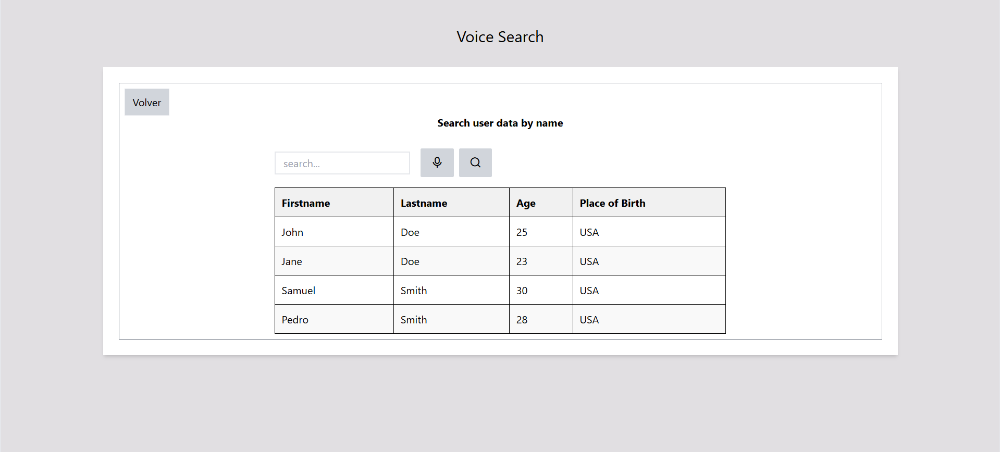

# Buscador por voz

Una aplicación sencilla que permite obtener un dato válido por voz y usarlo para filtrar una serie de datos.


## 📋 Requisitos previos

Asegúrate de tener instalado:

- [Node.js](https://nodejs.org/) (si es una app con JavaScript moderno)
- Un navegador actualizado

## 🚀 Instalación y Uso

1. Clona este repositorio:

   ```bash
   git clone https://github.com/nozen-eighty-six/Voice-search.git
2. Accede a la carpeta del proyecto:

   ```bash
   cd nombre-del-repositorio
3. Instala las dependencias:

   ```bash
   npm install
4. Inicia la aplicación:

   ```bash
   npm run dev
## 🛠️ Tecnologías Utilizadas

Este proyecto fue desarrollado con las siguientes tecnologías:

### 📌 Frontend:
- React con Vite
- Tailwind CSS
- Remix Icon (para los íconos)


## 📷 Capturas de Pantalla




